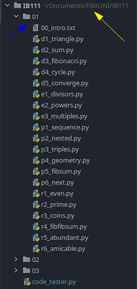
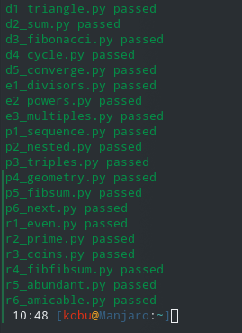
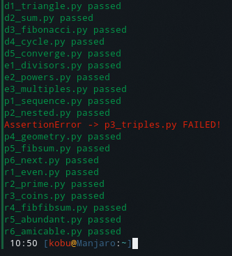
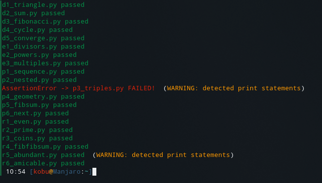

Currently only supported on gnu/linux

### Used by

This project is ment for FI MUNI students to help them test multiple assigments easier and faster.
### Installation
There are no dependencies, but you need to configure several variables:
- `FOLDER_PATH` Stores the path to the folder where your assigments files are
- `IGNORE_LIST` Every file thats not an assigment or that you dont want to test should be stored here
- `PYTHON_ALIAS` Stores the alias for python on your machine. Usually "python" or "python3"
- `FOLDER_ARGUMENT_INDEX` advanced users only: change this if you are saving the script as a bash alias

You can install this file anywhere as long as these variables are correctly set
### Usage
You can simply invoke it with command `python3 path_to_this_file/code_tester.py folder_to_test`

For the given project structure you would:
- set `FOLDER_PATH` to the yellow arrow
- pass blue arrow (01) as the second argument to the command

Therefore the command would look like `python3 ~/Documents/FIMUNI/IB111/code_tester.py 01`

And this is the output (if all your tests are passing ;))

### Errors and warnings
This is the output if there are exceptions raised in your code. Exception is always displayed the first, then the file.
This way you can tell if your tests are failing (AssertionError) or if theres an error in your code (any other exception)

Ive decided to warn the user of any forgotten print statements as those are not desirable.

### Final words
You can change any of the colors as you wish.
If you have any troubles getting this running you can DM me on discord at `GM Kobu#5271`